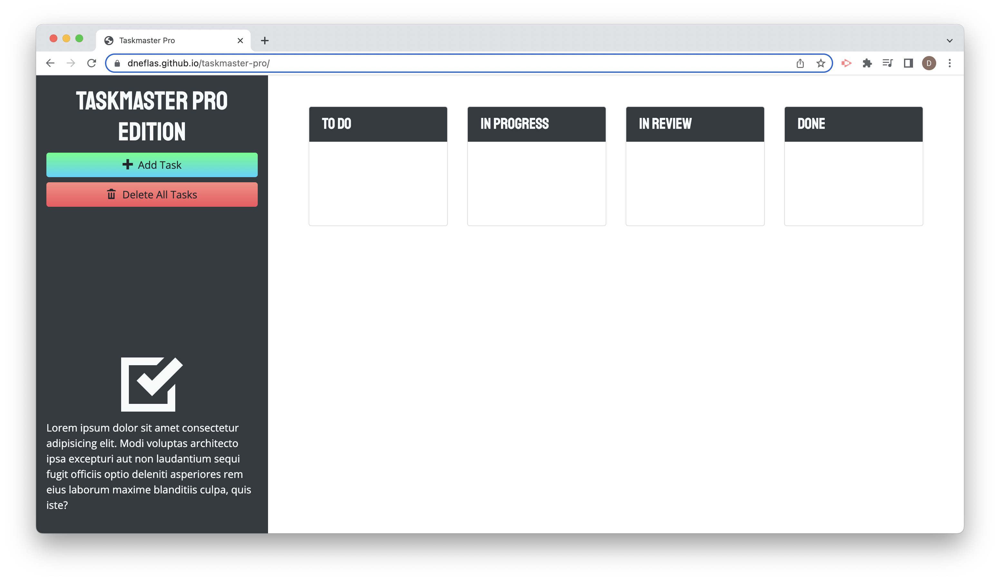

# Taskmaster Pro

## Description
Taskmaster Pro application is designed to organize task using a Kanban format. Once a task is created dynamically, it can be dragged an dropped to different positions within a column, into a different column category or into the trash.

## Built With
* HTML
* CSS
* Javascript
* JQuery
* Bootstrap
* MomentJS
* Google Fonts
* Open Iconic

## Deployed Application

https://dneflas.github.io/taskmaster-pro/
